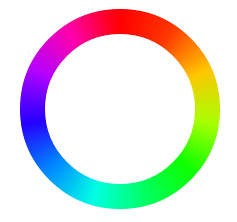

android-circular-progress-bar
=============================

A customizable circular progress bar for Android.

# Why use this?

We wanted a circular progress bar with a customizable starting point, direction, and complex gradients.  We found that we couldn't do that with the stock Android components (ring shape, sweep gradient, etc.).  So we built our own.

# Examples

## Beautiful gradients

```java
ProgressBar progressBar = (ProgressBar) view.findViewById(R.id.progress_bar);

CircularProgressBarDrawable drawable = new CircularProgressBarDrawable();
drawable.setColors(new int[]{0xffff0000, 0xffff00a8, 0xffb400ff, 0xff2400ff, 0xff008aff,
        0xff00ffe4, 0xff00ff60, 0xff0cff00, 0xffa8ff00, 0xffffc600, 0xffff3600, 0xffff0000});
progressBar.setProgressDrawable(drawable);
progressBar.setMax(100);
progressBar.setProgress(100);
```

## Custom starting points

## Custom directions

# Installation

## Gradle

## Maven

## Jar
